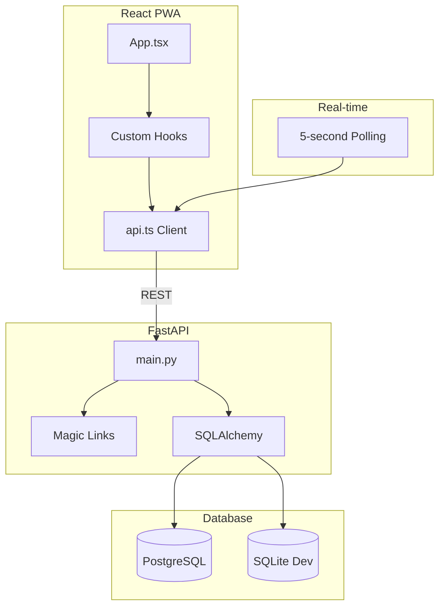

# TEACHME: Shared Tasks

> A task app for couples who want to share chores without the spreadsheet arguments.

## The Problem This Solves

Household task management between partners is a minefield:
- "I thought YOU were doing that"
- "I always do the dishes, you never do"
- "What still needs to be done this week?"

Shared calendars are overkill. Texting "can you pick up milk" gets buried. What we needed was:
- A shared list both can see
- Clear ownership (claimed vs. unclaimed)
- A "done" feed showing who did what
- Simple enough to actually use

## How It Works (The Mental Model)

Think of it as a **shared refrigerator list with accountability**:

```
Task created → Up for Grabs → Claimed by Partner → Completed → Done Feed
```

Three states, three columns:
1. **Your Tasks** — Tasks you've claimed
2. **Up for Grabs** — Unclaimed tasks anyone can take
3. **Partner's Tasks** — What they're working on

The Done Feed shows the last 7 days of completions. Gentle accountability: you can see who's pulling their weight.

## Architecture at a Glance



**Simplicity-first:**
- No WebSockets—just 5-second polling
- Magic links for auth—no passwords
- PWA for mobile—install without app stores
- Household model—invite partner with 6-char code

## The Tech Stack (And Why)

| Layer | Choice | Why |
|-------|--------|-----|
| **Frontend** | React 19 + TypeScript | Latest React, type safety |
| **State** | Custom hooks | No Redux overhead needed |
| **Styling** | Tailwind CSS | Rapid UI development |
| **PWA** | vite-plugin-pwa | Easy service worker setup |
| **Backend** | FastAPI | Fast, typed, auto-docs |
| **Database** | PostgreSQL | Render provides it |
| **Auth** | Magic links + JWT | No passwords to forget |

**Why polling over WebSockets?** For a 2-person app with infrequent updates:
- WebSockets add complexity (connection management, reconnection)
- 5-second polling is imperceptible for humans
- Much simpler deployment (no WebSocket proxy config)

## Code Tour: The Key Files

| File | What It Does | Why It Matters |
|------|--------------|----------------|
| `src/App.tsx` | Root component, routing | Hook orchestration |
| `src/hooks/useAuth.ts` | Auth state + magic links | Login flow |
| `src/hooks/useHousehold.ts` | Household management | Partner pairing |
| `src/hooks/useTasks.ts` | Task CRUD + polling | The main interaction |
| `src/components/TaskCard.tsx` | Single task UI | Swipe-to-complete |
| `backend/main.py` | All API routes | Static file serving too |
| `backend/auth.py` | JWT + magic link generation | Token handling |
| `backend/models.py` | User, Household, Task | SQLAlchemy models |

## Patterns Worth Stealing

### 1. Swipe-to-Complete (Mobile)

Touch gestures for quick task completion:

```typescript
const handleTouchMove = (e: TouchEvent) => {
    const diff = e.touches[0].clientX - startX.current;
    if (diff > 60) {
        // Swipe right = complete
        setSwipeOffset(diff);
        cardRef.current.style.background = `rgba(34, 197, 94, ${diff / 200})`;
    }
};
```

**Why this is great:** One thumb gesture while holding your phone. No buttons to tap.

### 2. Magic Link Flow

No passwords. Just email:

```python
@app.post("/auth/magic-link")
def send_magic_link(email: str):
    token = create_magic_token(email)
    # In dev: return token directly
    # In prod: email the link
    return {"token": token}  # Dev only!

@app.post("/auth/verify")
def verify_magic_link(token: str):
    email = verify_magic_token(token)
    jwt = create_access_token(email)
    return {"access_token": jwt}
```

**Why this is great:** No password reset flows. No "forgot password" support tickets.

### 3. Household Invite Codes

6-character codes for partner pairing:

```python
def generate_invite_code() -> str:
    return ''.join(random.choices(string.ascii_uppercase + string.digits, k=6))

# "ABC123" - easy to read aloud to your partner
```

### 4. Optimistic UI Updates

Update the UI before the server confirms:

```typescript
const completeTask = async (taskId: string) => {
    // Optimistic update
    setTasks(prev => prev.map(t => 
        t.id === taskId ? {...t, completed: true, completed_by: user.id} : t
    ));
    
    // Server sync (errors will be caught by polling)
    await api.completeTask(taskId);
};
```

**Why this is great:** App feels instant. Polling corrects any discrepancies.

### 5. Multi-Path Static Serving

The backend serves the frontend, but paths differ in dev vs prod:

```python
DIST_PATHS = [
    Path(__file__).parent.parent / "dist",      # Dev: ../dist
    Path(__file__).parent / "dist",              # Prod: ./dist
    Path("/app/dist"),                           # Container: /app/dist
]

for path in DIST_PATHS:
    if path.exists():
        app.mount("/", StaticFiles(directory=path, html=True))
        break
```

## Lessons Learned

### Bug: Database URL Format

**Problem:** Render uses `postgres://`, SQLAlchemy wants `postgresql://`.
**Solution:** String replacement:
```python
url = os.environ.get("DATABASE_URL", "")
if url.startswith("postgres://"):
    url = url.replace("postgres://", "postgresql://", 1)
```

### Bug: PWA Cache Staleness

**Problem:** Users stuck on old versions after deploy.
**Solution:** `workbox` auto-update strategy:
```typescript
// vite.config.ts
VitePWA({
    registerType: 'autoUpdate',
    workbox: {
        skipWaiting: true,
        clientsClaim: true,
    }
})
```

### Pitfall: CORS with Credentials

**Problem:** Cookies not sent cross-origin.
**Solution:** Both sides must agree:
```python
# Backend
app.add_middleware(CORSMiddleware, allow_credentials=True, ...)
```
```typescript
// Frontend
fetch(url, { credentials: 'include' })
```

### Discovery: SessionStorage for Pending Actions

User clicks invite link → needs to auth first → then join household:

```typescript
// Before auth
sessionStorage.setItem('pendingJoinCode', code);

// After auth
const pending = sessionStorage.getItem('pendingJoinCode');
if (pending) {
    await joinHousehold(pending);
    sessionStorage.removeItem('pendingJoinCode');
}
```

## If I Were Starting Over...

1. **Add recurring tasks** — "Take out trash every Tuesday"
2. **Task history per item** — "Who did this last time?"
3. **Push notifications** — When partner completes something
4. **Categories/tags** — Kitchen, Garden, Shopping, etc.

## Mental Models

### Think: Tasks = Batons

A task is a baton in a relay race:
- **Unclaimed:** Baton on the ground
- **Claimed:** Someone picked it up
- **Completed:** Passed to the finish line

The Done Feed is the photo finish—proof of who crossed.

### Think: Households = Shared Namespaces

Everything (tasks, users) lives within a household. The invite code is the key to enter:

```
Household "ABC123"
├── User: Alice
├── User: Bob
└── Tasks: [Buy milk, Fix door, Call plumber]
```

### Think: Polling = Heartbeat

Every 5 seconds, the app asks: "What's changed?"

This is less efficient than WebSockets but:
- Simpler to implement
- Works through any proxy/firewall
- Automatic reconnection (it's just HTTP)

For a 2-person app, the overhead is negligible.

---

*This document is part of Mark's personal engineering wiki. Last updated: 2026-02-01*
